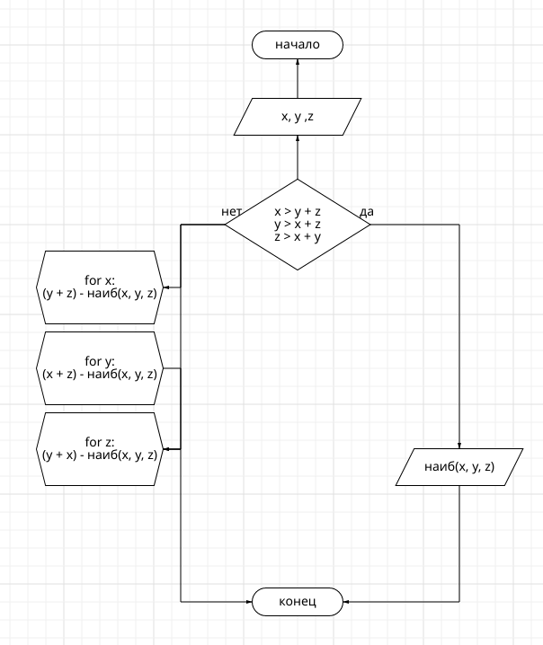
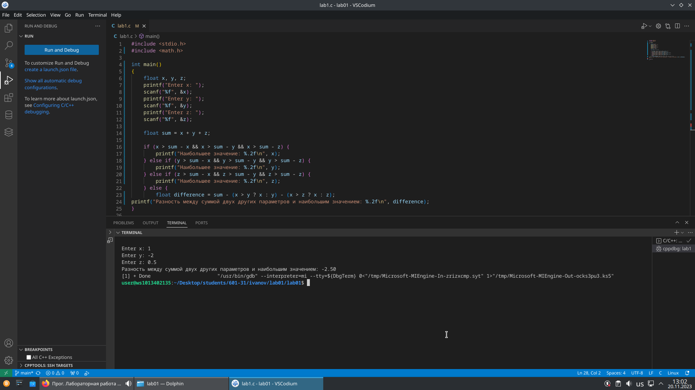

# lab01

## Сложность: Rare
## Второй вариант
## Задание

1. Разберите код программы из примера.
2. Составьте блок-схему алгоритма для своего варианта.
3. Напишите программу, решающую задачу по своему варианту.
4. Оформите отчёт в README.md. Отчёт должен содержать:
   * Задание
   * Описание проделанной работы
   * Скриншоты результатов
   * Блок-схему
   * Ссылки на используемые материалы

## Задание второго варианта:

Вывести значение наибольшего из трёх параметров x, y, z если оно больше суммы двух других параметров, и разность этой суммы и наибольшего значения иначе.

## Ход работы

1. Ссылка на репозиторий: 

    https://github.com/guiiilty/lab01.git

2. Скопировал его себе на пк:

```shell 
git clone https://github.com/guiiilty/lab01.git:
```

3. Разобрал код программы из примера

4. Составил блок-схему алгоритма для своего варианта

  

5. Решение
- 1. Написал программу, решающую задачу по своему варианту

```shell
#include <stdio.h>

int max_of_three(int x, int y, int z) {
    if (x > y + z) {
        return x;
    } else if (y > x + z) {
        return y;
    } else if (z > x + y) {
        return z;
    } else {
        return abs(x + y + z - (x > y ? (x > z ? x : z) : (y > z ? y : z)));
    }
}

int main() {
    int x = 1;
    int y = -2;
    int z = 0.5;

    int result = max_of_three(x, y, z);
    printf("Результат: %d\n", result);

    return 0;
}
```
- 2. Результаты работы программы

 

6. Скомпиллировал и запустил её

 

7. Получил по отдельности результаты каждого этапа компиляции

- Препроцессор


- Компилятор 


- Объектные файлы

 